# THE INVISIBLE HACKER WRITE-UP

---

# Task 2: Enumeration

## Step 1: Port Scanning

The enumeration phase begins with scanning the target machine using Nmap. A full port scan is performed to identify all open ports.

Command used:

```
nmap -Pn -p- <TARGET_IP>
```

This reveals the total number of open ports on the system.
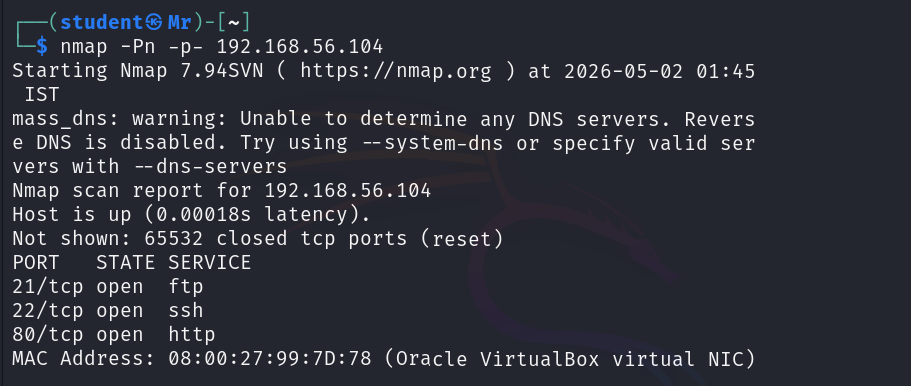

**Answer:**
How many ports are open?
3

---

## Step 2: Service Identification

Once open ports are identified, service and version detection is performed to determine which services are running.

Command used:

```
nmap -Pn -p- -sV <TARGET_IP>
```
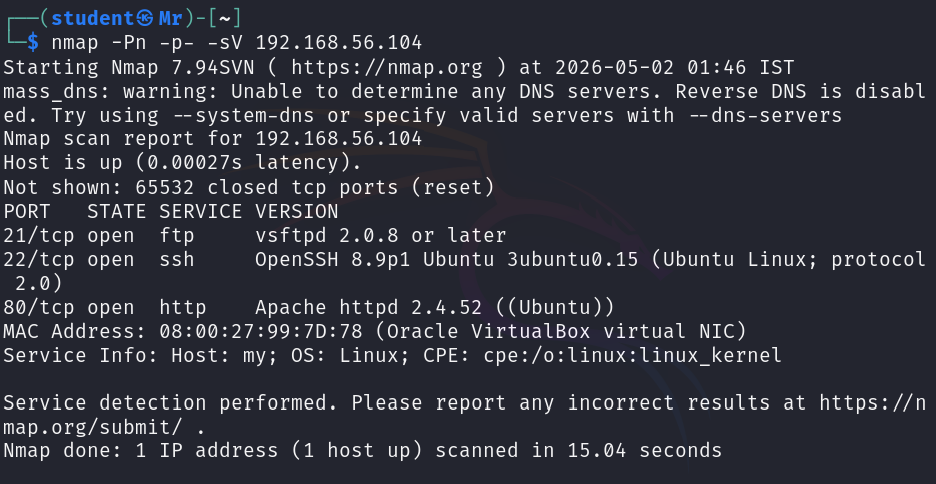
From the results, the web service is identified.

**Answer:**
What port is the web server running on? 

---

## Step 3: Hidden File Discovery

After accessing the web server through a browser, common files are checked for hidden information. One such file is:
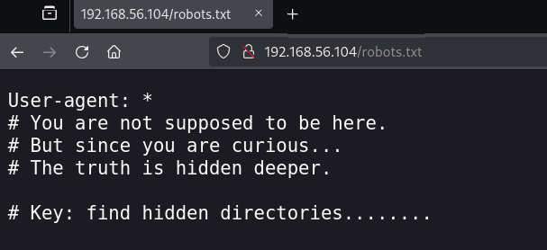
This file contains disallowed paths that may reveal sensitive directories.

**Answer:**
What hidden file reveals disallowed paths?
robots.txt

---

## Step 4: Hidden Directory Enumeration

The contents of the discovered file are reviewed to identify hidden directories. Directory brute-forcing is also performed to uncover additional paths.

Command used:

```
dirb http://<TARGET_IP>/ /path/to/wordlist
```
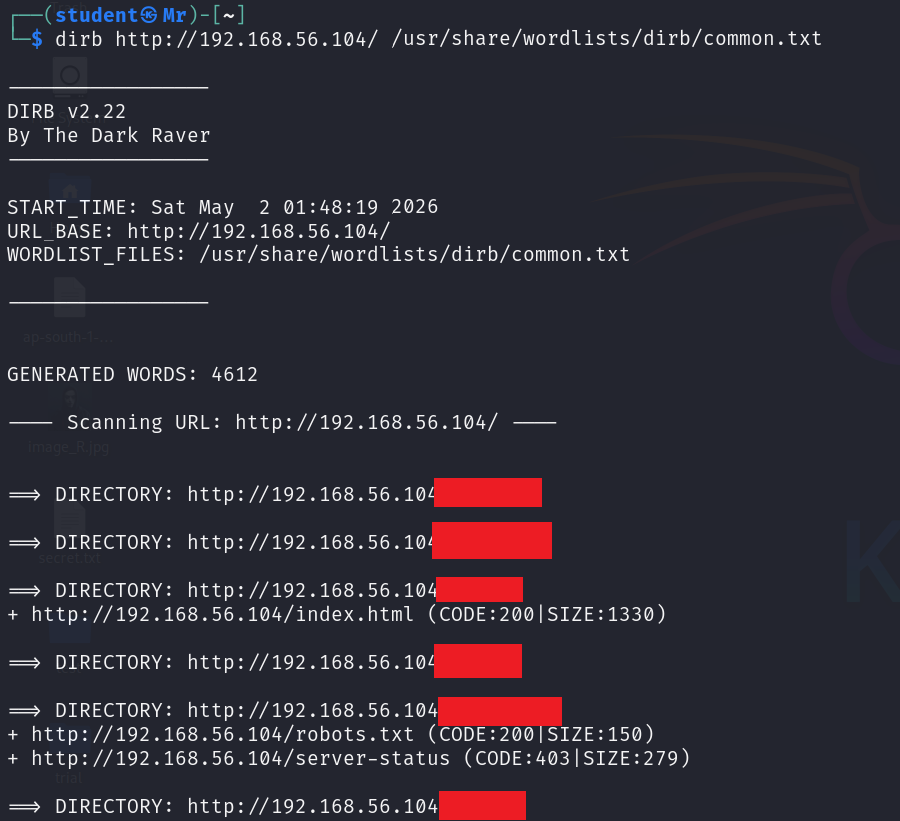
One of the discovered directories contains encrypted text.
Visit all the directories to find the encrypted text.
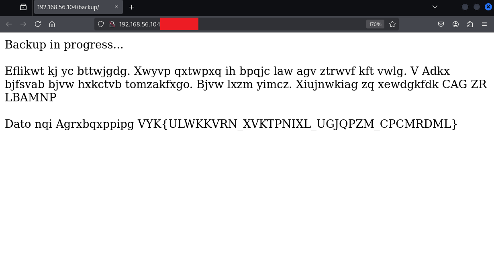
**Answer:**
Name the hidden directory that has the encrypted text 

---

# Task 3: Cryptography

## Approach

The encrypted text found in the hidden directory is analyzed and identified as a Vigenère cipher. The ciphertext is decrypted using appropriate tools.

After successful decryption, the flag is obtained.
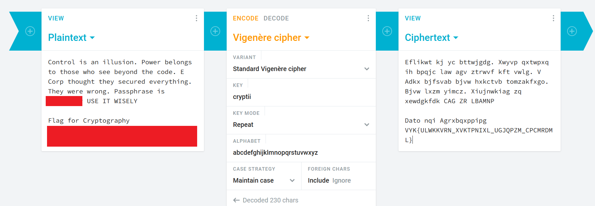
**Answer:**
What is the flag given in the encrypted text? 
---

# Task 4: FTP Enumeration

## Approach

The FTP service is accessed and enumerated to identify available files.

Commands used:

```
ftp <TARGET_IP>
ls
```
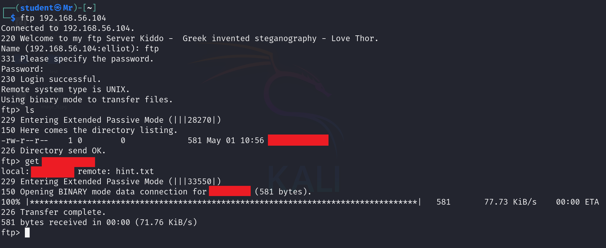
A file of interest is discovered during enumeration.

**Answer:**
Give the file name you found while enumerating FTP services 

---

# Task 5: Bypassing Login

## Approach

The login page is tested for vulnerabilities and found to be susceptible to SQL injection. Authentication is bypassed using a crafted payload.

Payload used:

```
Username: ' OR 1=1#
Password: random
```
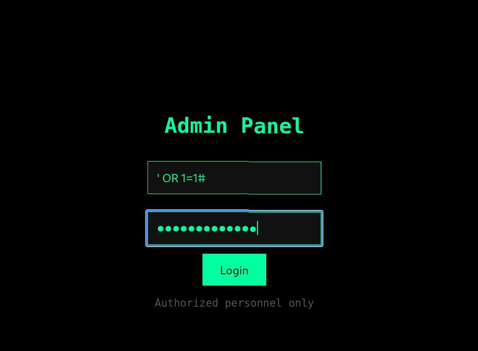
This grants access to the application and reveals a message from Elliot Alderson.
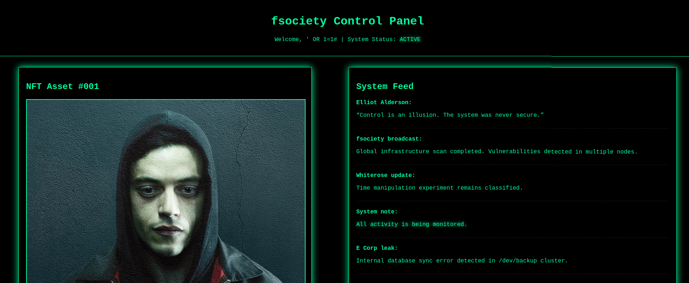
**Answer:**
After bypassing the login page, what is the statement of Elliot Alderson? 

---

---

# Task 6: Access to Elliot

## Approach

After bypassing the login page, a file is discovered and downloaded from the application. This file is an NFT image that contains hidden data.

The file is analyzed using **steghide** to extract embedded content. During extraction, the passphrase obtained earlier from the decrypted text (Task 3) is used.

Command used:

```
steghide extract -sf <file_name>
```
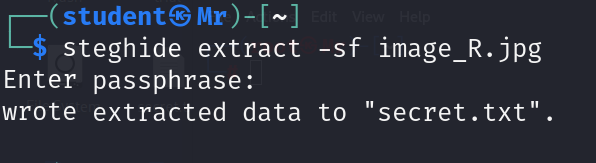
This process reveals a file named `secret.txt`. The contents of this file are then viewed to obtain Elliot’s credentials.

Command used:

```
cat secret.txt
```
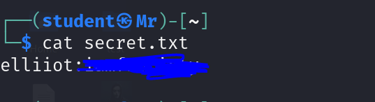
The extracted credentials are used to establish SSH access to the system as Elliot.

**Answer:**
What is Elliot’s password? 

---

After successfully logging in as Elliot, further enumeration of the user’s directories leads to the discovery of the user flag.

```
ssh elliot@<targetIP>
```
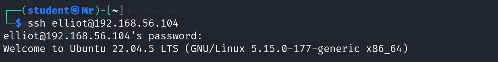
**Answer:**
What is the user flag?

---

# Task 7: Privilege Escalation

## Step 1: Check Sudo Permissions

Sudo permissions are enumerated to identify potential privilege escalation vectors.

Command used:

```
sudo -l
```

**Answer:**
What command lists sudo permissions?
sudo -l
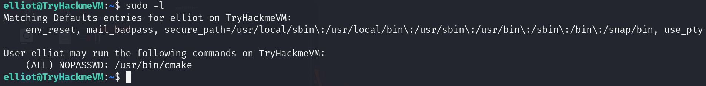
---

## Step 2: Identify Misconfigured Tool

Analysis of sudo permissions reveals a misconfigured binary that allows command execution.

**Answer:**
Which tool is misconfigured and allows command execution?
cmake

---

## Step 3: Exploitation Using GTFOBins

The misconfigured binary is exploited using techniques from GTFOBins. Arbitrary commands are executed to obtain a root shell.

Commands used:

```
cd /tmp
echo 'execute_process(COMMAND /bin/sh)' > CMakeLists.txt
cmake .
```
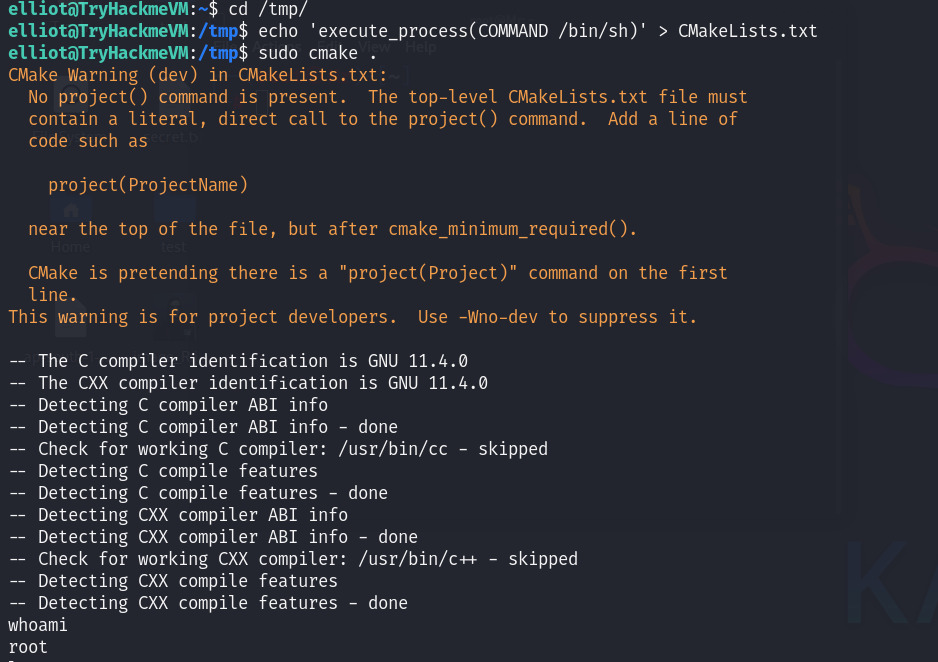
---

## Step 4: Retrieve Root Flag

With elevated privileges, the root directory is accessed and the final flag is retrieved.
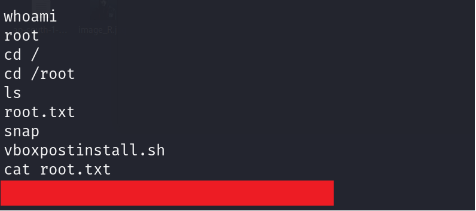
**Answer:**
What is the root flag? 

---
